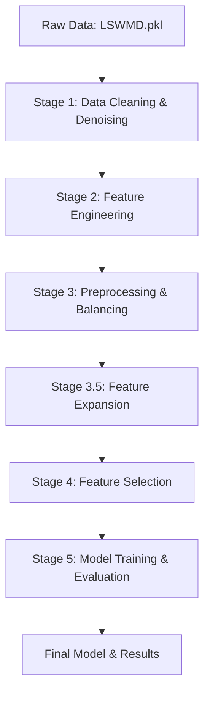

# 🔬 WM-811K Wafer Defect Classification Using Machine Learning

[](https://www.python.org/)
[](https://scikit-learn.org/)
[](https://xgboost.readthedocs.io/)
[](LICENSE)

> **An end-to-end machine learning pipeline for semiconductor wafer defect classification with leak-proof architecture, advanced feature engineering, and intelligent class balancing.**

---

## 📋 Table of Contents

- [Overview](#overview)
- [Research Objectives](#research-objectives)
- [Key Features](#key-features)
- [Dataset](#dataset)
- [Quick Start](#quick-start)
- [Pipeline Architecture](#pipeline-architecture)
- [Project Structure](#project-structure)
- [How to Run](#how-to-run)
- [Technologies Used](#technologies-used)
- [Testing](#testing)

---

## Overview

This project implements a **scientifically rigorous, 5-stage machine learning pipeline** to classify defect patterns in semiconductor wafer maps using the **WM-811K dataset**. The pipeline is designed with a "Gatekeeper" architecture to ensure **zero data leakage** and features advanced techniques for handling **severe class imbalance** (~90% "none" class).

### Why This Project Matters

In semiconductor manufacturing, early defect detection is critical for:
- **Reducing production costs** by identifying faulty processes
- **Improving yield rates** through systematic quality control
- **Enabling predictive maintenance** via pattern recognition

---

---

## Research Objectives

This project addresses three primary research objectives:

1. **Optimal Feature Set Identification**: To identify the optimal feature set for each machine learning algorithm by evaluating different feature combinations through multi-track feature selection (RFE, Random Forest Importance, and Lasso regularization).

2. **Algorithm Performance Comparison**: To compare the performance of various traditional machine learning algorithms (SVM, Decision Tree, Random Forest, KNN, Logistic Regression, Gradient Boosting, and XGBoost) for wafer defect classification using consistent evaluation metrics.

3. **Model Generalizability Assessment**: To assess the generalizability of the trained models by testing their performance on a combined dataset composed of multiple individual defect datasets, ensuring robust real-world applicability.

---

## Key Features

- **Zero Data Leakage**: Test set is locked away before any preprocessing, ensuring honest evaluation
- **Hybrid Class Balancing**: Combines SMOTE (upsampling) for minorities and undersampling for majorities
- **Multi-Track Feature Selection**: Three parallel approaches (RFE, RF Importance, Lasso) compete to find optimal features
- **High-Dimensional Feature Engineering**: Expands 66 base features to 8,500+ interaction terms
- **One-Click Execution**: Automated batch script handles dependencies and runs entire pipeline
- **Scientific Rigor**: 3-fold stratified cross-validation with locked test sets

---

## Dataset

**WM-811K Wafer Map Dataset**
- **Source**: [Kaggle Dataset](https://www.kaggle.com/datasets/qingyi/wm811k-wafer-map)
- **Size**: 811,457 wafer maps
- **Format**: Pickle file (`LSWMD.pkl`)
- **Classes**: 9 defect patterns (Center, Donut, Edge-Loc, Edge-Ring, Loc, Near-full, Random, Scratch, none)
- **Challenge**: Severe class imbalance (~90% "none", <1% for rare defects)

---

## Quick Start

### For New Users - One-Click Setup! 🚀

**Windows:**
1. Double-click `setup.bat` to install everything automatically
2. Download dataset from [Kaggle](https://www.kaggle.com/datasets/qingyi/wm811k-wafer-map) (if not included)
3. Place `LSWMD.pkl` in `datasets/` folder
4. Double-click `run_pipeline.bat` to run!

**Linux/macOS:**
1. Run `python setup.py` to install everything
2. Download dataset from [Kaggle](https://www.kaggle.com/datasets/qingyi/wm811k-wafer-map) (if not included)
3. Place `LSWMD.pkl` in `datasets/` folder
4. Run `python ml_flow/main.py`

> ✨ **See [QUICK_START.md](QUICK_START.md) for detailed step-by-step instructions and troubleshooting**

### Prerequisites
- **Python 3.9+** (Required for scikit-learn 1.7.2+)
- **8GB+ RAM** recommended
- **5GB+ disk space** for dataset and results

### Manual Installation (Advanced Users)

<details>
<summary>Click to expand manual installation steps</summary>

1. **Clone the repository**:
   ```bash
   git clone https://github.com/mohamadfirdaussz/Wafer-defect-classificassion-using-machine-learning-project.git
   cd Wafer-defect-classificassion-using-machine-learning-project
   ```

2. **Create virtual environment**:
   ```bash
   python -m venv .venv
   .venv\Scripts\activate  # Windows
   source .venv/bin/activate  # Linux/Mac
   ```

3. **Install dependencies**:
   ```bash
   pip install -r requirement.txt
   ```

4. **Prepare Dataset**:
   - Download `LSWMD.pkl` from [Kaggle](https://www.kaggle.com/datasets/qingyi/wm811k-wafer-map)
   - Create a `datasets/` folder in the project root
   - Place `LSWMD.pkl` inside: `datasets/LSWMD.pkl`

</details>

---

## Pipeline Architecture

The pipeline follows a strict sequential flow with 5 stages:



### Stage Overview

| Stage | Script | Input | Output | Purpose |
|-------|--------|-------|--------|---------|
| **1** | `data_loader.py` | Raw `LSWMD.pkl` | Cleaned 64×64 arrays | Cleaning, denoising, resizing |
| **2** | `feature_engineering.py` | Cleaned arrays | 66 features CSV | Extract density, Radon, geometry features |
| **3** | `data_preprocessor.py` | Feature CSV | Balanced train + locked test | Train/test split, scaling, SMOTE balancing |
| **3.5** | `feature_combination.py` | Balanced data | 8,500+ features | Generate polynomial interactions |
| **4** | `feature_selection.py` | Expanded features | 3 optimized datasets (25 features each) | Multi-track feature selection (RFE/RF/Lasso) |
| **5** | `model_tuning.py` | Selected features | Trained models + leaderboard | Train 7 ML models, hyperparameter tuning |

---

## Project Structure

```plaintext
Wafer-defect-classificassion-using-machine-learning-project/
│
├── datasets/                             # Place LSWMD.pkl here
│   └── LSWMD.pkl                         # WM-811K dataset (download required)
│
├── ml_flow/                              # Core Pipeline Scripts
│   ├── config.py                         # Centralized configuration
│   ├── main.py                           # Master pipeline controller
│   ├── data_loader.py                    # Stage 1: Data cleaning
│   ├── feature_engineering.py            # Stage 2: Feature extraction
│   ├── data_preprocessor.py              # Stage 3: Preprocessing & balancing
│   ├── feature_combination.py            # Stage 3.5: Feature expansion
│   ├── feature_selection.py              # Stage 4: Feature selection
│   ├── model_tuning.py                   # Stage 5: Model training
│   └── unit_test.py                      # Unit test suite
│
├── dashboard/                            # Interactive Web Dashboard
│   ├── dashboard_server.py               # Flask backend
│   └── index.html                        # Frontend UI
│
├── data_loader_results/                  # Stage 1 output
├── Feature_engineering_results/          # Stage 2 output
├── preprocessing_results/                # Stage 3 output
├── feature_selection_results/            # Stage 4 output
├── model_artifacts/                      # Stage 5 output (models + metrics)
│
├── setup.bat                             # 🆕 One-click setup (Windows)
├── setup.py                              # 🆕 Cross-platform setup script
├── run_pipeline.bat                      # 🆕 Enhanced pipeline launcher
├── create_distribution.bat               # 🆕 Create distribution package (Windows)
├── create_distribution.py                # 🆕 Create distribution package (Cross-platform)
├── QUICK_START.md                        # 🆕 Quick start guide
├── requirement.txt                       # Python dependencies
└── README.md                             # This file
```

---


## How to Run

### Option 1: One-Click Execution ⚡ (Windows - Recommended)

**First Time Setup:**
```
Double-click: setup.bat
```

**Run Pipeline:**
```
Double-click: run_pipeline.bat
```

The scripts will automatically:
1. ✅ Verify Python installation and version (3.9+)
2. ✅ Create and activate virtual environment
3. ✅ Install all dependencies from `requirement.txt`
4. ✅ Execute all 5 pipeline stages sequentially
5. ✅ Generate results in organized output directories
6. ✅ Display results summary and locations

### Option 2: Cross-Platform Execution (Linux/macOS/Windows)

**Setup:**
```bash
python setup.py
```

**Run Pipeline:**
```bash
python ml_flow/main.py
```

### Option 3: Manual Execution (All Platforms)

Run the master controller:
```bash
# Activate virtual environment first
.venv\Scripts\activate  # Windows
source .venv/bin/activate  # Linux/Mac

# Run pipeline
python ml_flow/main.py
```

### Option 4: Run Individual Stages (For Debugging)


```bash
cd ml_flow

# Stage 1: Clean and denoise data
python data_loader.py

# Stage 2: Extract features
python feature_engineering.py

# Stage 3: Preprocess and balance
python data_preprocessor.py

# Stage 3.5: Expand features
python feature_combination.py

# Stage 4: Select features
python feature_selection.py

# Stage 5: Train models
python model_tuning.py
```

### Expected Output

After completion, you'll find results in:
- `data_loader_results/` - Cleaned wafer maps
- `Feature_engineering_results/` - Extracted features
- `preprocessing_results/` - Preprocessed data
- `feature_selection_results/` - Selected features (3 tracks)
- `model_artifacts/` - **Master leaderboard** (`master_model_comparison.csv`), trained models, confusion matrices, ROC curves

---

## 📦 Creating Distribution Package

Want to share this project with others? Create a complete package:

**Windows:**
```
Double-click: create_distribution.bat
```

**Cross-Platform:**
```bash
python create_distribution.py
```

This creates a ZIP file containing:
- All source code
- Setup scripts
- Dataset (if present in your project)
- Documentation

Recipients can simply extract and run `setup.bat` for instant deployment!

---

## Technologies Used

### Core ML Libraries
- **NumPy** & **Pandas**: Data manipulation
- **scikit-learn**: ML algorithms, preprocessing, metrics
- **scikit-image**: Radon transform, image processing
- **imbalanced-learn**: SMOTE and undersampling
- **XGBoost**: Gradient boosting framework
- **LightGBM**: Fast gradient boosting

### Visualization
- **Matplotlib** & **Seaborn**: Static plots
- **Plotly**: Interactive charts

### Web Dashboard
- **Flask**: Backend API
- **HTML/CSS/JavaScript**: Frontend UI

---

## Testing

### Run Unit Tests

```bash
cd ml_flow
python unit_test.py
```

### Tests Cover
1. ✅ Data loading and resizing
2. ✅ Feature extraction (66 features)
3. ✅ Scaling and preprocessing
4. ✅ Feature expansion math
5. ✅ Model configuration loading

**Expected Output**:
```
......
----------------------------------------------------------------------
Ran 6 tests in 2.5s

OK
```

---

## Interactive Dashboard (Optional)

### Launch Dashboard
```bash
cd dashboard
python dashboard_server.py
```

Then open browser to: `http://localhost:5000`

**Features**:
- Performance metrics visualization
- Upload wafer map for real-time classification
- Feature importance charts
- Confusion matrix exploration

---

## Results & Metrics

The pipeline evaluates models using:
- **F1-Macro Score**: Unweighted average across all classes (emphasizes minorities)
- **Per-Class F1 Score**: Identifies strong/weak defect patterns
- **Confusion Matrix**: Visualizes misclassifications
- **ROC-AUC**: One-vs-rest multiclass performance

Final results saved in `model_artifacts/master_model_comparison.csv`

---

## Contributing

Contributions are welcome! Please:
1. Fork the repository
2. Create a feature branch
3. Commit your changes
4. Open a Pull Request

---

## Author

**Mohamad Firdaus**
- GitHub: [@mohamadfirdaussz](https://github.com/mohamadfirdaussz)
- Email: mohamad_firdaus_bs22@iluv.ums.edu.my

---

## Acknowledgments

- **WM-811K Dataset**: Created by MIR Lab, Taiwan
- **Kaggle Community**: For hosting the dataset
- **scikit-learn Contributors**: For excellent ML tools

---

<div align="center">

**Star this repository if you find it helpful!**

*Made for the semiconductor manufacturing community*

</div>