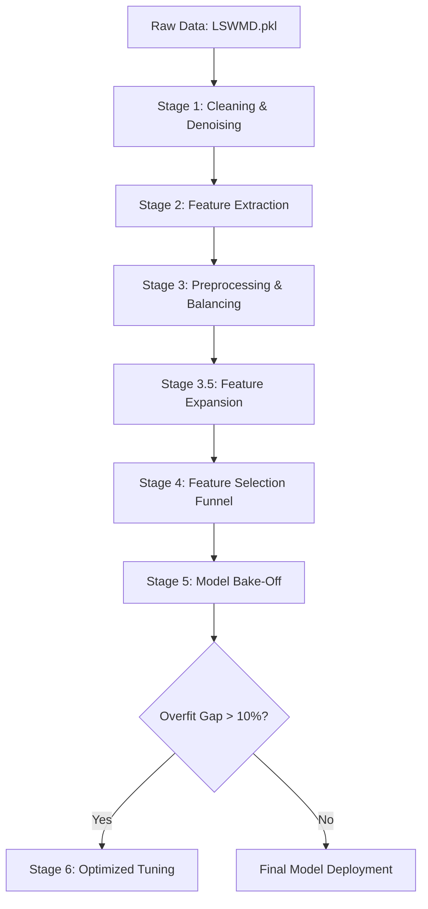

# 🔬 WM-811K Wafer Defect Classification

This project implements a **leak-proof, 6-stage machine learning pipeline** for classifying semiconductor wafer defects using the WM-811K dataset. It leverages traditional ML techniques with high-dimensional feature engineering and dynamic class balancing.

---

## 🚀 Quick Start (One-Click)

For **Windows** users:
1.  **Download** `LSWMD.pkl` from [Kaggle](https://www.kaggle.com/datasets/qingyi/wm811k-wafer-map).
2.  **Place** it in a folder named `datasets/` in the project root.
3.  **Double-click** `run_pipeline.bat`.

The script will automatically handle dependency installation and execute the full pipeline.

---

## 🛠️ Installation

```bash
pip install -r requirement.txt
```

---

## 📈 Pipeline Architecture

The pipeline is designed with a **"Gatekeeper" architecture** to ensure zero data leakage between training and testing.



### 1. **Cleaning & Denoising** (`data_loader.py`)
- Removes near-full and unlabeled wafers.
- Applies 2x2 Median Filter for denoising.
- Resizes maps to a standard $64 \times 64$ using Nearest-Neighbor interpolation.

### 2. **Feature Extraction** (`feature_engineering.py`)
- Extracts **66 base features**: Radon Transform (lines/scratches), Density (13 regions), Geometry (Area, Perimeter), and Statistics.

### 3. **The Gatekeeper** (`data_preprocessor.py`)
- **🛡️ Leakage Prevention**: Locks away 30% for testing *before* any balancing.
- **⚖️ Hybrid Balancing**: Applies SMOTE (Upsampling) for minority classes and Undersampling for the 'none' class on the training set only.

### 4. **Feature Selection Funnel** (`feature_selection.py`)
- Expands 66 features $\to$ ~8,500 interaction terms.
- Funnels them through **ANOVA filter** and three tracks: **Lasso**, **RFE**, and **Random Forest**.

---

## 🏃 Usage

Run the master controller to execute the full experiment:
```bash
python ml_flow/main.py
```

### Manual Execution (Debugging)
You can run individual stages as standalone scripts from within the `ml_flow/` directory:
- `python data_loader.py`
- `python feature_engineering.py`
- `python data_preprocessor.py`
- `python model_tuning_optimized.py` (Stage 6)

---

## 📂 Project Structure

```plaintext
.
├── datasets/                 # Input: LSWMD.pkl
├── ml_flow/                  # Source Code 🧠
├── data_loader_results/      # Stage 1 Outputs
├── preprocessing_results/    # Stage 3/3.5 Balanced Assets
├── feature_selection_results/# Stage 4 Selected Tracks
├── model_artifacts/          # Stage 5/6 Visuals & Leaderboards
└── logs/                     # Pipeline Logs
```

---

## 🧪 Testing

Verify the integrity of the entire pipeline:
```bash
python ml_flow/unit_test.py
```

---
> **Note**: This pipeline emphasizes **Scientific Validity**. It measures the **Overfit Gap** ($F1_{Train} - F1_{Test}$) to ensure models generalize to organic, imbalanced real-world data.